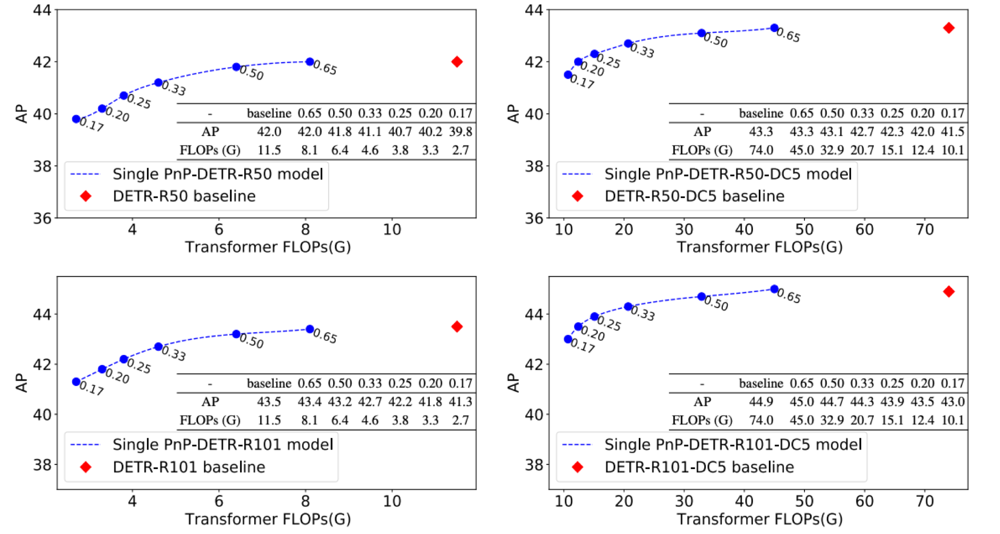

# Implementation of ICCV 2021 paper: PnP-DETR: Towards Efficient Visual Analysis with Transformers  [arxiv](https://arxiv.org/abs/2109.07036)

This repository is based on [detr](https://github.com/facebookresearch/detr)

Recently, DETR pioneered the solution of vision tasks with transformers, it directly translates the image feature map into the object detection result. Though effective, translating the full feature map can be costly due to redundant computation on some area like the background. In this work, we encapsulate the idea of reducing spatial redundancy into a novel poll and pool (PnP) sampling module, with which we build an end-to-end PnP-DETR architecture that adaptively allocates its computation spatially to be more efficient. Concretely, the PnP module abstracts the image feature map into fine foreground object feature vectors and a small number of coarse background contextual feature vectors. The transformer models information interaction within the fine-coarse feature space and translates the features into the detection result. Moreover, the PnP-augmented model can instantly achieve various desired trade-offs between performance and computation with a single model by varying the sampled feature length, without requiring to train multiple models as existing methods. Thus it offers greater flexibility for deployment in diverse scenarios with varying computation constraint. We further validate the generalizability of the PnP module on panoptic segmentation and the recent transformer-based image recognition model ViT and show consistent efficiency gain. We believe our method makes a step for efficient visual analysis with transformers, wherein spatial redundancy is commonly observed.




# Usage
First, clone the repository locally:
```
git clone https://github.com/twangnh/pnp-detr
```
Then, install PyTorch 1.5+ and torchvision 0.6+:
```
conda install -c pytorch pytorch torchvision
```
Install pycocotools (for evaluation on COCO) and scipy (for training):
```
conda install cython scipy
pip install -U 'git+https://github.com/cocodataset/cocoapi.git#subdirectory=PythonAPI'
```
That's it, should be good to train and evaluate detection models.

(optional) to work with panoptic install panopticapi:
```
pip install git+https://github.com/cocodataset/panopticapi.git
```

## Data preparation

Download and extract COCO 2017 train and val images with annotations from
[http://cocodataset.org](http://cocodataset.org/#download).
We expect the directory structure to be the following:
```
path/to/coco/
  annotations/  # annotation json files
  train2017/    # train images
  val2017/      # val images
```

## Training
To train PnP-DETR on a single node with 8 gpus for 300 epochs run:
```
python -m torch.distributed.launch --nproc_per_node=8 --use_env main.py --coco_path /path/to/coco 
```
you can adjust the range of random poll ratio with --sample_ratio_lower_bound and --sample_ratio_higher_bound

Following DETR, We train PnP-DETR with AdamW setting learning rate in the transformer to 1e-4 and 1e-5 in the backbone.
Horizontal flips, scales an crops are used for augmentation.
Images are rescaled to have min size 800 and max size 1333.
The transformer is trained with dropout of 0.1, and the whole model is trained with grad clip of 0.1.


## Evaluation
To evaluate DETR R50 on COCO val5k with a single GPU run:
```
python main.py --batch_size 2 --no_aux_loss --eval --resume xxx --coco_path /path/to/coco --sample_topk_ratio xxx
```

## Multinode training
Distributed training is available via Slurm and [submitit](https://github.com/facebookincubator/submitit):
```
pip install submitit
```
Train baseline DETR-6-6 model on 4 nodes for 300 epochs:
```
python run_with_submitit.py --timeout 3000 --coco_path /path/to/coco
```

## Cite
Please consider to cite our paper:

```
@inproceedings{wang2021pnp,
  title={PnP-DETR: Towards Efficient Visual Analysis with Transformers},
  author={Wang, Tao and Yuan, Li and Chen, Yunpeng and Feng, Jiashi and Yan, Shuicheng},
  booktitle={Proceedings of the IEEE/CVF International Conference on Computer Vision},
  pages={4661--4670},
  year={2021}
}
```
